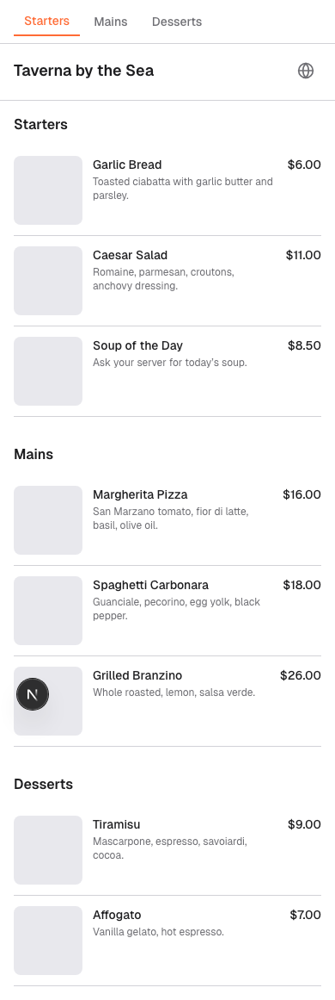
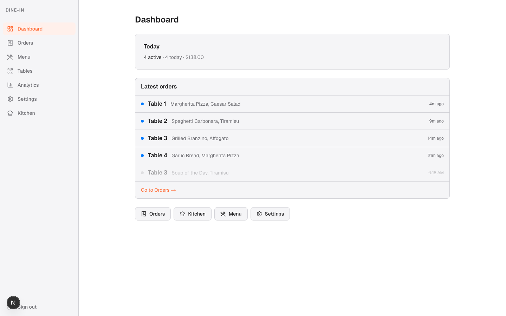
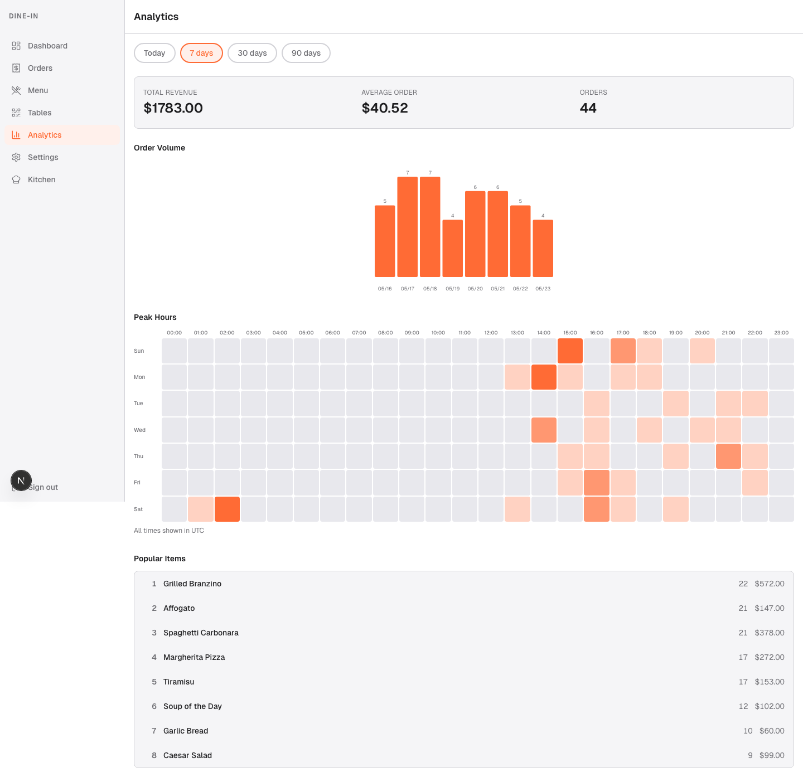

# dine-in-cc

QR-code dine-in ordering for restaurants. Guests scan a code at their table, browse the menu in their language, and place an order — no app install. Staff manage the menu, tables, and incoming tickets from an admin UI with real-time updates.

<p>
  <a href="#screenshots"><strong>Screenshots</strong></a> ·
  <a href="#features"><strong>Features</strong></a> ·
  <a href="#tech-stack"><strong>Tech Stack</strong></a> ·
  <a href="#project-structure"><strong>Structure</strong></a> ·
  <a href="#getting-started"><strong>Getting Started</strong></a> ·
  <a href="#testing"><strong>Testing</strong></a> ·
  <a href="#deployment"><strong>Deployment</strong></a>
</p>

## Screenshots

### Customer ordering (mobile)

The guest experience after scanning the QR code at their table — live menu grouped by category, with language switcher.

<p align="center">
  
</p>

### Admin

|                        Dashboard                         |                        Analytics                         |
| :------------------------------------------------------: | :------------------------------------------------------: |
|  |  |

## Features

### For guests (customer ordering)

- **No-app ordering.** Scan a per-table QR code at `/[restaurant_slug]/[table_number]`, browse the live menu, add items to a cart, and submit — all in the browser.
- **Item variants & options.** Size, modifier, and option selections on each menu item.
- **Multi-language menu.** Customers can switch between English, Spanish, French, Japanese, and Chinese.
- **Order confirmation screen.** Once submitted, guests see their ticket status.

### For restaurant operators (admin)

- **Drag-and-drop menu builder.** Categories, items, variants, photos, display order, and availability windows. Preview before publishing.
- **Table & QR management.** Generate, download, and print a unique QR code per table.
- **Real-time order feed & KDS.** New tickets appear in the orders dashboard and kitchen display within seconds (Supabase Realtime, with polling fallback).
- **Onboarding checklist.** Guided setup from signup → menu → tables → first order.
- **Analytics dashboard.** Revenue summary, order volume over time, peak-hour heatmap, and popular items.
- **Dashboard landing snapshot.** At-a-glance status when the operator logs in.

### Platform

- **Multi-tenant.** Each restaurant is isolated via row-level security; platform operators have a `/platform/tenants` admin for cross-tenant management.
- **Auth.** Email/password sign-up, login, password reset, with Supabase Auth + cookie-based SSR sessions. Custom access-token hook enriches JWT claims for RLS.

## Tech Stack

| Layer           | Choice                                                                                 |
| --------------- | -------------------------------------------------------------------------------------- |
| Framework       | [Next.js 16](https://nextjs.org) (App Router) + React 19                               |
| Language        | TypeScript                                                                             |
| Backend / DB    | [Supabase](https://supabase.com) — Postgres, Auth, Realtime, RLS                       |
| Supabase SSR    | `@supabase/ssr` for cookie-based sessions across server/client/middleware              |
| Styling         | [Tailwind CSS](https://tailwindcss.com) + `tailwindcss-animate`                        |
| UI primitives   | Custom components (shadcn/ui-inspired), `lucide-react` icons                           |
| Drag & drop     | `@dnd-kit/core` + `@dnd-kit/sortable` (menu builder)                                   |
| State           | [Zustand](https://github.com/pmndrs/zustand) (cart, client state)                      |
| QR codes        | `qrcode`                                                                               |
| i18n            | JSON dictionaries in `i18n/` (en, es, fr, ja, zh) with a coverage checker              |
| Error tracking  | [Sentry](https://sentry.io)                                                            |
| Unit tests      | [Vitest](https://vitest.dev) + Testing Library                                         |
| E2E / RLS tests | [Playwright](https://playwright.dev)                                                   |
| Deployment      | [OpenNext for Cloudflare](https://opennext.js.org/cloudflare) (also Vercel-compatible) |

## Project Structure

```
app/
  [restaurant_slug]/[table_number]/   Customer ordering flow (menu, cart, order)
  admin/                              Restaurant operator UI
    menu, tables, orders, kds, analytics, settings
  platform/tenants/                   Platform-level multi-tenant admin
  auth/                               Sign-up, login, forgot/update password
  api/
actions/                              Next.js Server Actions (auth, menu, order, restaurant, table)
components/
  customer/    admin/    platform/    marketing/    auth/    shared/
i18n/                                 Translation dictionaries (en, es, fr, ja, zh)
lib/         stores/      utils/      types/
supabase/migrations/                  SQL migrations (schema, RLS, triggers)
tests/                                Playwright E2E + RLS tests
scripts/                              i18n coverage checker, etc.
```

## Getting Started

### Prerequisites

- Node.js 20+
- A Supabase project ([create one](https://database.new))

### 1. Install

```bash
npm install
```

### 2. Configure environment

Copy `.env.example` → `.env.local` and fill in:

```env
NEXT_PUBLIC_SUPABASE_URL=...
NEXT_PUBLIC_SUPABASE_PUBLISHABLE_KEY=...
```

> Both legacy **anon** keys and new **publishable** keys work with `NEXT_PUBLIC_SUPABASE_PUBLISHABLE_KEY`. See the [Supabase key migration notes](https://github.com/orgs/supabase/discussions/29260).

### 3. Apply database migrations

Run the SQL files in `supabase/migrations/` against your Supabase project (via the Supabase CLI or dashboard SQL editor). These set up the schema, RLS policies, the custom-access-token auth hook, and the Realtime publication for orders.

### 4. Run the dev server

```bash
npm run dev
```

Open [http://localhost:3000](http://localhost:3000).

## Testing

```bash
npm run test          # Vitest unit tests
npm run test:watch    # Vitest watch mode
npm run test:e2e      # Playwright end-to-end suite
npm run test:rls      # Playwright RLS-policy tests against a real DB
npm run check:i18n    # Verify translation coverage across all locales
npm run lint
```

> RLS-sensitive paths (customer-facing Server Actions, anonymous sign-in flows) require a real-DB smoke test — mocked unit tests will not catch policy failures.

## Deployment

This project deploys to **Cloudflare** via OpenNext:

```bash
npm run build:cf      # Next build + opennextjs-cloudflare build
npx wrangler deploy
```

It will also run on Vercel with no additional configuration; `wrangler.toml` and `open-next.config.ts` are Cloudflare-specific and can be ignored on Vercel.

Sentry is wired up via `instrumentation.ts`, `instrumentation-client.ts`, and the `sentry.*.config.ts` files — set the corresponding `SENTRY_*` env vars in your hosting provider to enable error reporting.
