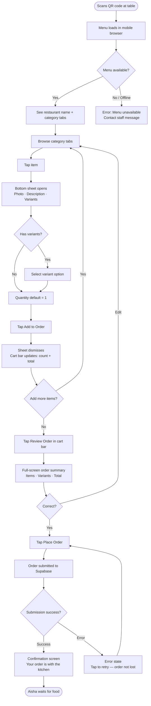
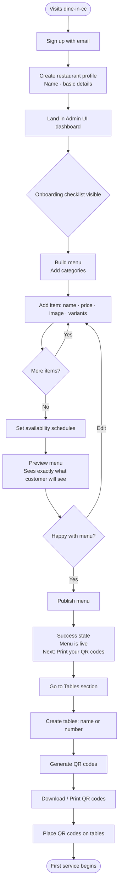
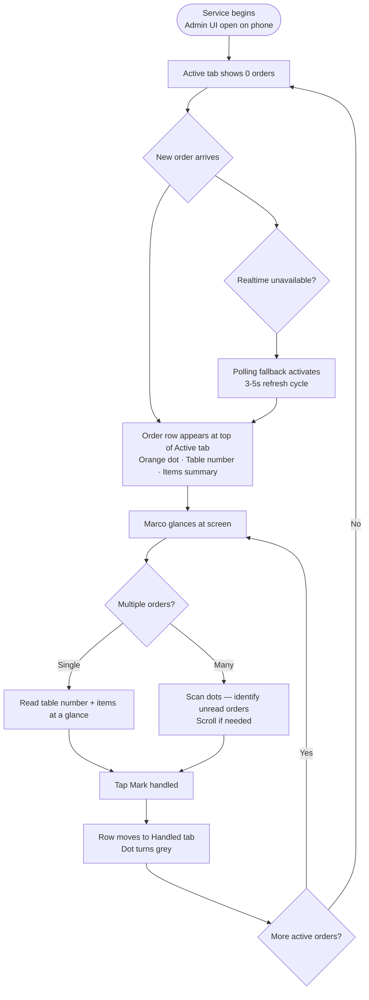
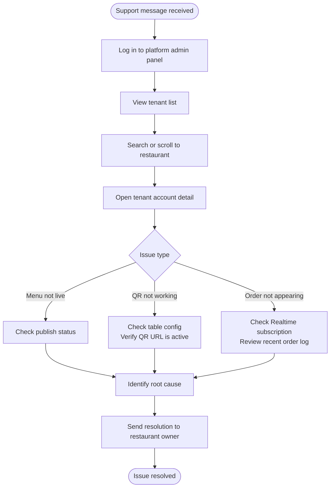

# UX Design Specification dine-in-cc

**Author:** Nic
**Date:** 2026-05-09

---

<!-- UX design content will be appended sequentially through collaborative workflow steps -->

## Executive Summary

### Project Vision

dine-in-cc is a multi-tenant SaaS QR ordering platform that replaces paper-based ordering workflows in restaurants. A restaurant owner signs up, builds their menu, generates per-table QR codes, and dine-in customers scan to self-order — no app install, no account, no staff handoff. The core promise: zero order transcription errors during live service, achieved through a completely self-serve, lightweight digital system that is dramatically cheaper and simpler than incumbents like Toast or Square.

### Target Users

| User | Profile |
|---|---|
| **Marco (Restaurant Owner)** | Non-technical operator running a paper-based restaurant. Values simplicity, speed, and self-serve control. Judges success by fewer wrong-item complaints and surviving a Friday service without chaos. |
| **Aisha (Dine-in Customer)** | Mobile-first, anonymous diner. Expects the QR-to-order flow to "just work." Zero tolerance for app installs or account creation. Primary device: whatever phone is in her pocket. |
| **Nic (Platform Admin)** | Operator and support role. Needs fast tenant lookup and account inspection. Low-frequency but high-stakes usage during support events. |

### Key Design Challenges

1. **Zero-friction customer flow** — Aisha has zero context, zero patience, and no account. The QR-to-order path must be near-instant and completely self-explanatory on any mobile browser.
2. **Owner confidence during live service** — Marco needs to trust the system mid-service rush. The order view must feel like a live, reliable feed — not a static page he has to refresh and wonder about.
3. **Menu builder complexity vs. simplicity** — Variants, images, availability schedules, categories, ordering, preview, and publish represent significant complexity for a non-technical user. The builder must feel lightweight while supporting real depth.
4. **Onboarding discoverability** — The QR code generation step is easy to miss (confirmed by Journey 4). Onboarding UX must lead owners through the setup sequence naturally without requiring support contact.

### Design Opportunities

1. **The "first publish moment"** — A clear publish confirmation with explicit next steps (print your QR codes) can drive immediate physical table setup and compress time-to-first-order.
2. **Trust signals in the customer confirmation** — The order confirmation screen is the only feedback signal Aisha receives. Getting that moment right builds trust in both the restaurant and the platform.
3. **Real-time order feed as the retention driver** — If the Admin UI order view feels instant and reliable, it replaces paper-order anxiety entirely. That emotional shift is the core retention hook.

## Core User Experience

### Defining Experience

There are two sides of the same value loop, and both must be nailed:

- **Customer side (Aisha):** QR scan → menu loads → item configured → order submitted.
  This flow must be near-instant, require zero explanation, and work on any mobile browser
  without an account or app install. If it feels like filling out a form, it has failed.

- **Owner side (Marco):** Submitted order appears in the Admin UI within seconds —
  without Marco refreshing, asking staff, or wondering. The feed must feel live and
  trustworthy during a Friday night rush.

These two moments are inseparable: the customer flow creates the order, the Admin UI
receives it. Neither delivers value without the other.

### Platform Strategy

| Surface | Platform | Primary Context |
|---|---|---|
| Customer ordering flow | Mobile-web (any browser, no install) | Seated at table, one hand, low attention |
| Admin UI — order view | Mobile-first web (responsive) | Walking the floor with a phone OR behind counter with laptop/tablet |
| Admin UI — menu builder | Desktop-primary web | Set up in advance, not during service |
| Platform admin panel | Desktop web | Occasional support use |

**Key constraint:** The Admin UI order feed must be fully functional on a phone in motion. Marco cannot be expected to squint at a desktop-scale table during a rush. The menu builder can be desktop-primary — it's a setup task, not a live-service task.

### Effortless Interactions

**Customer flow — must require zero thought:**
- QR scan → menu loads (no splash screen, no loading spinner, no onboarding prompt)
- Item selection and variant configuration in a single tap sequence
- Order review and submission with a single confirm action
- Confirmation screen that is immediate and unambiguous

**Admin UI — must feel automatic:**
- New orders appear without any refresh action
- Order cards are scannable at a glance on a phone screen (table number, items, time)
- Marking an order handled is a single tap with no confirmation dialog required

**Owner onboarding — must be self-completing:**
- After publish, the next step (print QR codes) is surfaced immediately — not buried

### Critical Success Moments

1. **First order received (Marco):** The moment Marco sees a live customer order appear in the Admin UI during his first service. This is the emotional proof that the system works. If this moment is delayed, confusing, or requires a page refresh, the product has failed at its core promise.

2. **First order submitted (Aisha):** The confirmation screen after order submission. This is the only signal Aisha gets. It must be clear, immediate, and reassuring — "Your order has been received" with no ambiguity about whether it went through.

3. **First publish (Marco onboarding):** The moment Marco publishes his menu and is immediately shown how to generate and print QR codes. If he has to hunt for this step, time-to-first-service stretches and support burden increases.

### Experience Principles

1. **The system is invisible.** Neither Aisha nor Marco should think about the technology. Aisha thinks about her food. Marco thinks about his kitchen. The UX gets out of the way.

2. **Live service is sacred.** During active service hours, the Admin UI must never require a deliberate user action to stay current. Real-time delivery is not a feature — it is the baseline contract.

3. **Mobile-first, all the way through.** The customer flow is mobile-only by design. The Admin UI order view must be equally first-class on a phone in motion. Desktop enhancements are additive, not the baseline.

4. **Onboarding earns the first service.** The owner setup flow must land Marco at his first service with QR codes printed and menu live — not at the settings page wondering what's next. Success is measured by time-to-first-real-order, not time-to-account-created.

5. **Complexity lives in setup, not in service.** Variants, schedules, categories, and images are configured in advance. During live service, both Marco and Aisha should encounter zero configuration decisions.

## Desired Emotional Response

### Primary Emotional Goals

| User | Primary Emotion | The Moment It Lands |
|---|---|---|
| **Aisha (customer)** | Quiet confidence | Confirmation screen — "it went through, I'm done" |
| **Marco (owner)** | Relief | First clean service — the burden of paper is gone |
| **Nic (platform admin)** | Competence | Finding a tenant record and resolving a support issue quickly |

Marco's emotional goal is **relief, not pride**. He is not looking to feel like he's running a modern tech-forward restaurant. He wants the anxiety of paper orders — the shouted tickets, the wrong items, the Friday night chaos — to simply be gone. The product earns his trust by being invisible and reliable, not by looking impressive.

### Emotional Journey Mapping

**Aisha — Customer Flow**

| Stage | Target Emotion | Risk Emotion |
|---|---|---|
| QR scan → menu loads | Instant confidence | Confusion ("is this the right page?") |
| Browsing menu | Calm, low-effort engagement | Overwhelm, decision fatigue |
| Configuring variants | In control | Uncertainty about what she selected |
| Submitting order | Decisiveness | Doubt ("did that go through?") |
| Confirmation screen | Quiet relief — done | Anxiety about whether the kitchen got it |
| Food arrives correctly | Invisible satisfaction | — |

**Marco — Owner Flow**

| Stage | Target Emotion | Risk Emotion |
|---|---|---|
| First setup session | In control, self-sufficient | Lost, needing to call support |
| First publish | Accomplished, ready | Uncertain what to do next |
| First real service | Calm vigilance | Anxious, watching the screen |
| First clean service | Relief — "the paper problem is solved" | Distrust ("was that a fluke?") |
| Repeat services | Quiet confidence | Complacency about system health |

### Micro-Emotions

**Confidence over confusion** — Every interaction must leave the user more certain, not less. Ambiguous states (did that submit? is the menu live?) are the enemy.

**Relief over excitement** — dine-in-cc is not a delight product. Neither Marco nor Aisha needs to be wowed. They need the job done cleanly, without drama. Restraint in design serves this better than animation or celebration.

**Trust over novelty** — Real-time order delivery must feel dependable, not clever. The Admin UI should not feel like a live dashboard — it should feel like a reliable kitchen window.

**Calm over urgency** — Even when multiple orders arrive at once, the UI must not feel alarming. Marco should feel in command, not overwhelmed by an inbox.

### Design Implications

- **Relief → no confirmation dialogs for routine actions.** Marking an order handled should take one tap and disappear. Friction signals distrust.

- **Quiet confidence → muted visual language.** No aggressive color, no notification badges piling up. A calm neutral palette with clear hierarchy signals the system is under control.

- **Avoid doubt → unambiguous status states.** Every order, every menu item, every publish action must have a clear, readable status. "Live," "Draft," "Received" — not icons alone, not color alone.

- **Relief after publish → explicit next-step prompt.** After Marco publishes, the system should say exactly what to do next: "Your menu is live. Print your QR codes and place them on tables." No hunting.

- **Aisha's confirmation → immediate and final.** The confirmation screen should feel like a closed loop. No spinners, no "processing..." — a clear, warm "Your order has been received by the kitchen."

### Emotional Design Principles

1. **Earn relief, not applause.** The product succeeds when users stop thinking about it. Celebrations and animations work against this. Design for quiet competence.

2. **Doubt is a design failure.** Any moment where a user wonders "did that work?" is a bug. Status clarity is a first-class design requirement, not a nice-to-have.

3. **Calm scales.** The emotional tone must hold under pressure — during a Saturday rush, with 10 orders in the queue, with Marco on his phone in a crowded dining room. Design for the hard moment, not the demo.

4. **Trust is built by disappearing.** Every service that runs without Marco thinking about the software is a successful trust-building event. The goal is for the product to become furniture.

## UX Pattern Analysis & Inspiration

### Inspiring Products Analysis

**Uber Eats — Reference for Aisha's Customer Flow**

What it does well:
- Menu browsing is category-first, image-led, and requires no explanation
- Item configuration (size, extras, removals) is a single bottom-sheet flow — one screen, one confirm tap, back to the menu
- The cart is always visible but never intrusive — a persistent bottom bar with item count and total
- Order submission is a single prominent CTA with no ambiguity
- Post-order confirmation is immediate, full-screen, and unambiguous — the user knows the order is placed before they put their phone down

What not to carry over:
- Uber Eats is account-heavy, upsell-heavy, and notification-aggressive — none of which apply to dine-in-cc's anonymous, zero-account, zero-marketing flow
- Rating prompts, reorder suggestions, promotions — all noise for our context
- The delivery tracking phase is irrelevant; our confirmation screen is the end state, not the beginning of a tracking journey

**Square POS — Reference for Marco's Admin UI Order View**

What it does well:
- Order cards are dense but scannable — table/seat, items, time elapsed, and status readable at a glance without drilling in
- Actions are large tap targets optimised for a phone or tablet held in one hand
- Status transitions (new → in progress → done) are single-tap with no confirmation dialog — the flow trusts the operator
- The visual language is calm and functional: muted palette, strong typography hierarchy, no decorative chrome
- It holds up under load — 10 simultaneous orders don't create visual chaos, they stack cleanly

What not to carry over:
- Square's full POS complexity (payment rails, inventory, employee management) is irrelevant — we want the order view discipline, not the full product surface
- Square assumes a fixed terminal; we need the same calm to work on a phone in motion, which requires tighter tap targets and less horizontal density

### Transferable UX Patterns

**Navigation Patterns**
- **Category tab bar (Uber Eats)** → Apply to the customer menu: top-level categories as horizontal tabs or sticky section headers, letting Aisha jump directly to what she wants without scrolling the full menu
- **Single-screen modal for item config (Uber Eats)** → Apply to variant selection: one bottom sheet per item, confirm returns to menu — never navigate away from the menu context

**Interaction Patterns**
- **Persistent cart bar (Uber Eats)** → Apply to customer flow: a sticky bottom bar showing item count and "Review Order" CTA, always visible once the first item is added — no hunting for the cart
- **One-tap status transition (Square POS)** → Apply to order management: "Mark handled" is one tap, no dialog, card moves to handled state immediately
- **Card-based order list (Square POS)** → Apply to Admin UI order feed: each order is a self-contained card with all required info visible without expanding

**Visual Patterns**
- **Full-screen confirmation (Uber Eats)** → Apply to Aisha's post-submit screen: large, clear, unambiguous — the order is received, full stop
- **Muted functional palette (Square POS)** → Apply to Admin UI: neutral background, strong type hierarchy, colour used only for status (new order accent, handled state muted) — not for decoration

### Anti-Patterns to Avoid

- **Account creation gates:** Uber Eats requires sign-in; dine-in-cc must never ask Aisha to create an account or log in. Any prompt that implies account management in the customer flow is a failure.
- **Upsell interruptions:** Uber Eats injects promotions, sponsored items, and reorder nudges throughout the flow. In dine-in-cc, the menu is the restaurant's menu — no platform-driven content injected anywhere.
- **Confirmation dialogs on routine actions:** Any "Are you sure?" prompt on marking an order handled or similar low-stakes actions adds friction and signals distrust. Reserve dialogs for genuinely destructive actions only.
- **Notification badge accumulation:** Aggressive unread counts and badges create urgency and anxiety. The order feed should feel like a calm incoming queue, not an overflowing inbox.
- **Horizontal-dense layouts for mobile:** Square POS works beautifully on a fixed tablet but can become cramped on a phone in portrait. Admin UI order cards must be designed portrait-first, with actions reachable by thumb.

### Design Inspiration Strategy

**Adopt directly:**
- Uber Eats category navigation pattern for menu browsing
- Uber Eats bottom-sheet item configuration flow
- Uber Eats persistent cart bar pattern
- Square POS card-based order list structure
- Square POS one-tap status transition (no confirmation dialog)
- Square POS muted, functional visual language

**Adapt for our context:**
- Uber Eats confirmation screen → simplify for dine-in (no tracking phase, no account link, just a clean closed-loop confirmation)
- Square POS order cards → redesign portrait mobile-first (taller cards, larger tap targets, thumb-zone actions)

**Explicitly avoid:**
- Account / login prompts anywhere in the customer flow
- Platform-injected content (promotions, suggestions, ratings)
- Confirmation dialogs on routine operator actions
- Horizontal-dense layouts that break on phone portrait

## Design System Foundation

### Design System Choice

**System:** design-md — Apple-inspired design framework
**Installation:** `npx getdesign@latest add apple`
**Source:** https://getdesign.md/apple/design-md

An Apple-aesthetic design system built on generous white space, SF Pro typography, cinematic imagery treatment, and a monochromatic visual language. Includes light and dark mode support out of the box.

### Rationale for Selection

| Factor | Decision |
|---|---|
| **Emotional alignment** | Monochromatic restraint directly supports "calm, relief, invisible system" — no decorative chrome competes for attention |
| **Typography** | SF Pro is the highest-legibility system font for iOS — Aisha's primary device. Falls back to system-ui gracefully on Android |
| **Imagery treatment** | Cinematic food photo handling elevates the customer menu without custom design work |
| **Admin UI fit** | White space and type hierarchy create the scannable, calm order feed Marco needs on a phone in motion |
| **Dark mode** | Built-in — critical for Marco working in a dimly lit restaurant floor |
| **Solo dev speed** | CLI install, pre-built components, no custom system to maintain |

### Implementation Approach

**Customer ordering flow (Aisha):**
- Light mode default — food photos read better on white
- Cinematic imagery treatment for menu item photos
- SF Pro for all type — category labels, item names, prices, confirmation copy
- Monochromatic palette with one accent for primary CTA (Add to Order, Place Order)

**Admin UI order view (Marco):**
- Dark mode available — optimised for low-light service environments
- High-contrast order cards — table number and item list scannable at arm's length
- Minimal color usage: one accent for new/unhandled orders, muted for handled
- Large tap targets throughout — portrait phone in one hand

**Admin UI menu builder (Marco — setup):**
- Light mode, desktop-primary layout
- Generous white space for form fields — item name, price, variants, image upload
- Preview mode mirrors the customer flow exactly — what Marco sees is what Aisha sees

### Customization Strategy

**Design tokens to define:**
- **Primary accent:** A single warm neutral (e.g. deep amber or slate) used exclusively for active CTAs and new-order highlights — not for decoration
- **Status colors:** New order (accent), in-progress (neutral), handled (muted/greyed)
- **Surface colors:** Light mode (white/near-white), dark mode (near-black with subtle elevation layers)
- **Type scale:** SF Pro Display for large headers (menu category names, confirmation screen), SF Pro Text for body (item descriptions, order details), SF Pro Mono for prices and table numbers

**Components to build on top of the system:**
- Order card (Admin UI) — custom portrait-mobile layout not in base system
- Persistent cart bar (customer flow) — sticky bottom CTA with item count
- Item configuration bottom sheet — single-screen variant selector
- Order confirmation screen — full-screen, closed-loop success state
- Menu category navigation — horizontal tab bar or sticky section headers

## Defining Core Experience

### 2.1 Defining Experience

> **"Scan the QR code — your order appears in the kitchen."**

This is the product in one sentence. Two sides of the same moment:
- **Aisha:** scan → browse → tap → confirm — done in under a minute, no account, no app
- **Marco:** order card appears on screen — no phone call, no shouted ticket, no paper

The defining interaction is order submission — the moment Aisha taps "Place Order" and the system closes the loop on both ends simultaneously.

### 2.2 User Mental Model

**Aisha's mental model:** Physical menu + waiter, minus the waiter.

She already knows how to order food. The flow maps directly onto her existing mental model: browse → decide → tell someone → done. dine-in-cc replaces "tell someone" with "tap confirm." No new behaviour to learn.

**The one gap to bridge:** Aisha needs to know her order reached the *kitchen*, not just "an app." The confirmation screen must say "the kitchen" explicitly — "Your order has been received by the kitchen" — not generic system language like "Order confirmed" or "Request submitted."

**Marco's mental model:** Kitchen ticket printer, minus the printer.

Marco is used to a physical ticket appearing when an order is placed. The Admin UI order feed must behave with the same immediacy — a new card appears, it demands attention, it can be marked done. Same mental model, better medium.

### 2.3 Success Criteria

**For Aisha (customer flow):**
- Menu loads within 3 seconds of QR scan — no loading screen, straight to food
- Item configuration completes in a single bottom-sheet interaction — one tap to add
- Order submitted in one confirm tap from the review screen
- Confirmation screen appears immediately — no spinner, no delay perception
- Confirmation copy explicitly references "the kitchen" — closes the mental loop

**For Marco (Admin UI order feed):**
- New order card appears within 5 seconds of Aisha's submission — without refresh
- Card shows table number, items, variants, and timestamp at a glance — no drill-in required
- "Mark handled" completes in one tap — card moves to handled state immediately
- Feed remains stable and readable with 10+ simultaneous orders — no visual chaos

### 2.4 Novel vs. Established Patterns

dine-in-cc uses **entirely established patterns** — deliberately. There is no novel interaction to teach. This is a core product decision: the lower the learning curve, the faster the adoption, the higher the trust.

| Interaction | Pattern Source | Why Established Works |
|---|---|---|
| QR scan → web page | Universal mobile camera behaviour | Zero education needed |
| Category tab navigation | Uber Eats, every food app | Users already know this |
| Bottom-sheet item config | Uber Eats, iOS sheets | Single-hand, stays in context |
| Persistent cart bar | Uber Eats | Cart always findable, never lost |
| Full-screen order review | Checkout flows everywhere | Familiar pre-submit ritual |
| Card-based order feed | Square POS, Trello | Scannable, stackable, actionable |
| One-tap status change | Square POS | Trusts the operator, no friction |

The only design innovation is **the combination**: a consumer-grade mobile ordering flow feeding directly into a mobile-first operational order view, with no POS complexity, no payments, no account friction. The innovation is in what's removed, not what's added.

### 2.5 Experience Mechanics

**Customer Flow — QR Scan to Confirmation**

**1. Initiation:**
- Customer scans QR code with phone camera — native iOS/Android camera, no app
- Browser opens directly to the restaurant's live menu
- Anonymous session token issued silently — no login prompt, no welcome screen
- First visible screen: the menu, category navigation at top, items below

**2. Browsing & Item Selection:**
- Category tabs at top — tap to jump section, no full-page scroll required
- Item card: food photo (cinematic, full-width), name, price, short description
- Tap item → bottom sheet slides up: photo thumbnail, full description, variant selectors, quantity control, "Add to Order" CTA
- Confirm → sheet dismisses, cart bar at bottom updates with count + total
- Repeat for additional items — always returns to menu context

**3. Order Review & Submission:**
- Tap "Review Order" in persistent cart bar → full-screen order summary
- Summary: each item, variants selected, quantity, line total, grand total
- Single "Place Order" CTA — prominent, full-width, no secondary actions
- Tap → immediate transition to confirmation screen (no spinner if possible)

**4. Confirmation:**
- Full-screen confirmation: restaurant name, "Your order has been received by the kitchen", order summary (items only, no prices repeated)
- No next-step prompts, no rating request, no account nudge — closed loop
- Screen persists — customer can refer back if needed

**Admin UI Order Feed — Order Received to Handled**

**1. Initiation:**
- Marco has the Admin UI open on phone or counter device during service
- New order arrives → card appears at top of feed (newest-first queue)
- Visual accent on new/unhandled cards — distinguishable at arm's length

**2. Reading the Order:**
- Card shows: table number (large, prominent), items + variants, time received
- All information visible without tapping or expanding — one-glance readable
- No modal, no drill-in required for standard orders

**3. Marking Handled:**
- Single "Mark Handled" tap on card — no confirmation dialog
- Card moves to handled state immediately: muted styling, drops to bottom or collapses
- Feed reorders to surface next unhandled order at top

**4. Completion:**
- Handled orders remain visible in session for reference — not deleted
- Marco can scroll down to review handled orders if needed
- No end-of-session action required — orders persist in history automatically

## Visual Design Foundation

### Color System

**Approach:** Monochromatic base with a single warm accent. Color is reserved for meaning — never decoration. The palette holds calm under load.

**Light Mode (customer flow, menu builder):**

| Token | Value | Usage |
|---|---|---|
| `surface-base` | `#FFFFFF` | Page background |
| `surface-raised` | `#F5F5F7` | Card backgrounds, bottom sheets |
| `surface-overlay` | `#E8E8ED` | Dividers, inactive states |
| `text-primary` | `#1D1D1F` | Headings, item names, prices |
| `text-secondary` | `#6E6E73` | Descriptions, timestamps, labels |
| `text-tertiary` | `#AEAEB2` | Placeholder text, disabled states |
| `accent` | `#FF6B35` | Primary CTA buttons, new-order highlight |
| `accent-muted` | `#FFF0EB` | Accent backgrounds, selected states |
| `success` | `#34C759` | Order confirmed, menu live indicator |
| `border` | `#D2D2D7` | Input borders, card dividers |

**Dark Mode (Admin UI order view — service environment):**

| Token | Value | Usage |
|---|---|---|
| `surface-base` | `#000000` | Page background |
| `surface-raised` | `#1C1C1E` | Order cards |
| `surface-overlay` | `#2C2C2E` | Handled order cards |
| `text-primary` | `#F5F5F7` | Table numbers, item names |
| `text-secondary` | `#AEAEB2` | Timestamps, variant details |
| `text-tertiary` | `#6E6E73` | Handled order text |
| `accent` | `#FF6B35` | New/unhandled order indicator |
| `accent-muted` | `#3A1A0A` | New order card left border accent |
| `success` | `#30D158` | Handled state confirmation flash |
| `border` | `#38383A` | Card borders |

**Accent rationale:** Warm amber-orange (`#FF6B35`) — high contrast against both white and black surfaces, universally associated with food/appetite, distinct from error red (no anxiety signal), calm enough not to feel alarming under load.

### Typography System

**Primary typeface:** SF Pro (Apple system font)
- iOS/macOS: renders as SF Pro natively
- Android/Windows: falls back to `system-ui` — still clean and legible
- No web font loading required — zero latency, no FOUT

**Type Scale (8px base, 1.25 ratio):**

| Role | Size | Weight | Line Height | Usage |
|---|---|---|---|---|
| `display` | 34px | 700 | 41px | Confirmation screen headline |
| `title-1` | 28px | 700 | 34px | Menu category headers (sticky) |
| `title-2` | 22px | 600 | 28px | Item name in bottom sheet |
| `title-3` | 20px | 600 | 25px | Order card table number |
| `body` | 17px | 400 | 22px | Item descriptions, order details |
| `callout` | 16px | 400 | 21px | Cart bar summary, variant labels |
| `footnote` | 13px | 400 | 18px | Timestamps, availability notes |
| `caption` | 12px | 400 | 16px | Status labels, secondary metadata |

**Price display:** SF Pro Mono (monospaced variant) — prices align vertically in lists and feel precise without looking technical.

### Spacing & Layout Foundation

**Base unit:** 8px — all spacing is a multiple of 8 (or 4 for micro-spacing).

| Token | Value | Usage |
|---|---|---|
| `space-1` | 4px | Icon-to-label gap, tight inline spacing |
| `space-2` | 8px | Between related elements within a component |
| `space-3` | 16px | Card internal padding, form field gaps |
| `space-4` | 24px | Between components, section gaps |
| `space-5` | 32px | Major section breaks |
| `space-6` | 48px | Page-level vertical rhythm |

**Border radius:**
- Cards, bottom sheets, modals: `16px` — iOS-native feel
- Buttons: `12px` — prominent but not pill-shaped
- Input fields: `10px`
- Status badges: `6px`

**Shadows (light mode only — dark mode uses borders instead):**
- Card elevation: `0 2px 8px rgba(0,0,0,0.08)`
- Bottom sheet: `0 -4px 24px rgba(0,0,0,0.12)`
- Sticky header: `0 1px 0 #D2D2D7` (1px border-bottom, not shadow)

**Layout grids:**
- Customer flow (mobile): single column, 16px horizontal margins
- Admin UI order feed (mobile): single column, 16px margins
- Admin UI menu builder (desktop): 12-column grid, 24px gutters, 1280px max-width

**Safe areas:** All tap targets minimum 44×44px (Apple HIG standard). Bottom navigation bars and cart bars respect iOS safe area insets.

### Accessibility Considerations

**Contrast compliance (WCAG 2.1 AA):**
- `text-primary` on `surface-base`: 16.1:1 — exceeds AA (4.5:1 required)
- `text-secondary` on `surface-base`: 5.9:1 — passes AA
- `accent` on `surface-base`: 3.1:1 — passes AA for large text (18px+) and UI components
- Dark mode `text-primary` on `surface-base`: 15.8:1 — exceeds AA

**Touch targets:** All interactive elements minimum 44×44px per Apple HIG. Bottom-sheet action buttons minimum 48px height for one-hand thumb use.

**Motion:** Respect `prefers-reduced-motion` — all transitions and animations disabled or replaced with instant state changes when set.

**Font scaling:** UI must remain functional at iOS Dynamic Type sizes up to `accessibilityXL` — avoid fixed-height containers that clip scaled text.

## Design Direction Decision

### Design Directions Explored

Six directions explored across five surfaces:
- Customer menu: D1 (Classic Apple — image rows), D2 (Ultra-minimal, text-only), D3 (Card-forward, magazine)
- Admin order feed: Direction A (full cards with inline actions), Direction B (compact list with status dots and active/handled tabs)
- Item configuration: Bottom sheet (confirmed in Step 7)
- Confirmation screen: Full-screen, kitchen-explicit copy

### Chosen Direction

| Surface | Choice | Rationale |
|---|---|---|
| Customer menu | **D1 — Classic Apple** | Image + text rows: food photos drive appetite and item recognition; horizontal category tabs match Uber Eats mental model; most natural reading pattern for a diner |
| Admin order feed | **Direction B — Compact List** | More orders visible per screen; dot-based status indicators readable at arm's length; Active/Handled tab separation keeps the live feed clean without visual noise from handled items |
| Item configuration | **Bottom sheet** | Stays in menu context, single-hand use |
| Confirmation screen | **No changes** — full-screen, kitchen-explicit copy as specified |

### Design Rationale

**D1 for customer menu:** Food photos are load-bearing in a restaurant context — they reduce decision time and build appetite before the order is placed. The horizontal category tab bar (Uber Eats model) requires zero learning. The row layout with right-aligned prices scales cleanly regardless of menu length.

**Direction B for Admin feed:** During a Friday rush with 8 simultaneous orders, compact rows mean Marco sees more of his queue without scrolling. The orange dot indicator is readable in peripheral vision — he doesn't need to read the card to know a new order arrived. The Active/Handled tab split keeps the live feed uncluttered; handled orders are still accessible but don't compete for attention.

### Implementation Approach

**Customer flow (D1):**
- `surface-base` (#FFFFFF) page background
- 80×80px food photos, `border-radius: 12px`, lazy-loaded
- Category tab bar: `border-bottom: 2px solid #FF6B35` for active state
- Item rows: 16px padding, `border-bottom: 1px solid #D2D2D7`
- Persistent cart bar: fixed bottom, `#FF6B35` background, iOS safe area inset

**Admin order feed (Direction B, mobile):**
- `surface-base` (#000000) dark background
- Compact rows: 8px status dot (orange = active, grey = handled)
- Active/Handled/All tab bar at top
- "Mark handled" as inline text link — single tap, no button chrome
- Row tap expands inline — no full-screen navigation

## User Journey Flows

### Journey 1: Aisha — QR Scan to Order Confirmation

**Key UX decisions:**
- No account prompt at any step — anonymous session issued silently on QR scan
- Error on submission retries rather than losing cart — critical trust protection
- Offline/unavailable menu shown before the customer invests time browsing
- "Review Order" only appears once cart has ≥1 item — no empty cart navigation

### Journey 2: Marco — First-Time Setup (Signup to First Service)

**Key UX decisions:**
- Onboarding checklist surfaces immediately after signup — no hunting for what to do
- Preview is mandatory-feeling — Marco sees his menu before any customer does
- Publish screen immediately surfaces QR code step — closes the Journey 4 gap
- Tables and QR codes reachable directly from the publish success prompt

### Journey 3: Marco — Live Service Order Management

**Key UX decisions:**
- No page refresh required — new orders surface automatically
- Active tab is default view during service — handled orders don't clutter it
- Polling fallback is silent — Marco's experience degrades gracefully
- Mark handled is a single tap — no confirmation dialog

### Journey 4: Nic — Platform Admin Support

### Journey Patterns

**Entry pattern — zero-friction start:** All customer-facing entry points complete without any user-initiated action beyond the trigger itself. No splash screens, no permission prompts, no welcome modals.

**Feedback pattern — immediate state change:** Every user action produces a visible state change within 100ms: add to order → cart bar updates instantly; mark handled → row style changes instantly (server confirmation follows).

**Error pattern — non-destructive recovery:** Errors never discard user progress. Failed order submission → retry prompt, cart preserved. Session expiry → re-issue anonymous token silently.

**Completion pattern — closed loop:** Every journey ends with an unambiguous completion signal. Customer: full-screen confirmation. Owner setup: publish success with explicit next step. Order handled: row moves to Handled tab.

### Flow Optimization Principles

1. **Steps to value:** Aisha's critical path is 6 taps from QR scan to confirmation. Every additional tap is a design failure.
2. **No dead ends:** Every error state has a recovery action. Every empty state has a contextual prompt.
3. **Progressive disclosure:** Complexity revealed only when needed — availability schedules not shown during browsing, variants only when item has them.
4. **Context preservation:** Navigation never loses the user's place. Bottom sheet dismisses back to menu position. Edit in builder returns to same item.

## Component Strategy

### Design System Components

Available from design-md (Apple-inspired base): Typography scale, Button (primary/secondary/destructive), Input field + label, Divider, Badge/pill, Card, Tab bar, Modal/dialog, Loading skeleton. These cover form inputs in the menu builder, admin login, settings pages, and generic structural layouts.

### Custom Components

**1. MenuItemRow**

| Attribute | Specification |
|---|---|
| **Purpose** | Displays a single menu item in the customer browse view (D1 layout) |
| **Anatomy** | 80×80px food photo (left) · Item name + description + price (right) |
| **States** | Default · Unavailable (muted, "Not available right now" label) |
| **Variants** | With image / Without image (graceful fallback to placeholder) |
| **Interaction** | Full row tappable — opens ItemConfigSheet |
| **Accessibility** | `role="button"`, `aria-label="{name}, {price}"`, min 44px touch target |
| **Content rules** | Name: max 2 lines. Description: max 2 lines truncated. Price: always visible |

**2. ItemConfigSheet**

| Attribute | Specification |
|---|---|
| **Purpose** | Bottom sheet for item configuration — photo, description, variants, add to order |
| **Anatomy** | Handle · Food photo (16:9 full-width) · Name + price · Description · Variant section · Add to Order CTA |
| **States** | Default · Variant selected · Add pending (CTA loading) |
| **Variants** | With variants / Without variants (shorter sheet, no variant section) |
| **Interaction** | Slides up on item tap. Dismiss via handle drag or tap outside. "Add to Order" dismisses and updates CartBar |
| **Accessibility** | `role="dialog"`, `aria-modal="true"`, focus trap while open, `Escape` closes |
| **Content rules** | Variant options: max 6 per group. Photo optional — placeholder if none |

**3. CartBar**

| Attribute | Specification |
|---|---|
| **Purpose** | Persistent bottom bar — visible from first item added to order review |
| **Anatomy** | Item count pill (left) · "Review Order" label (centre) · Total price (right) |
| **States** | Hidden (0 items) · Active (≥1 item) · Submitting (during Place Order) |
| **Interaction** | Full bar taps to Order Review. Fixed bottom, respects iOS safe area inset |
| **Accessibility** | `role="complementary"`, `aria-label="Cart: {count} items, {total}"`, live region on count change |

**4. OrderConfirmationScreen**

| Attribute | Specification |
|---|---|
| **Purpose** | Full-screen closed-loop confirmation after order submission |
| **Anatomy** | Check icon (green circle) · Headline · Subtext · Divider · Order summary · Restaurant + table tag |
| **States** | Success only — errors route back to order review with retry |
| **Accessibility** | `role="main"`, `aria-live="assertive"` on headline, focus moves to headline on mount |
| **Content rules** | Headline: "Your order is with the kitchen". Never show prices on this screen |

**5. OrderCard (Admin — compact row)**

| Attribute | Specification |
|---|---|
| **Purpose** | Single order row in the Admin UI compact feed |
| **Anatomy** | Status dot · Table number (bold) · Item summary (truncated) · Timestamp · "Mark handled" text link |
| **States** | Active (orange dot, full opacity) · Handled (grey dot, 40% opacity, no action) |
| **Variants** | Full-width row (mobile + desktop, single layout) |
| **Interaction** | "Mark handled" → immediate visual change, async server call. Row tap → expands inline to full item list |
| **Accessibility** | `role="article"`, `aria-label="Order for Table {n}, {items}, {time}"` |
| **Content rules** | Item summary: first 2 items named, remainder "+N more". Timestamp: relative up to 60 min, then absolute |

**6. OnboardingChecklist**

| Attribute | Specification |
|---|---|
| **Purpose** | Contextual setup guide in Admin UI dashboard until all steps complete |
| **Anatomy** | Progress indicator · Step list (icon + label + status) · CTA per incomplete step |
| **States** | Incomplete · Complete (checkmark, muted) · All complete (component is no longer rendered by `/admin`; replaced by **DashboardLandingSnapshot** — see #7) |
| **Variants** | Expanded (default) · Collapsed (dismissible after first completion) |
| **Content rules** | Steps: Add menu items → Preview → Publish → Create tables → Print QR codes |

**7. DashboardLandingSnapshot**

| Attribute | Specification |
|---|---|
| **Purpose** | Live service snapshot on `/admin` once onboarding is complete — replaces OnboardingChecklist as the dashboard landing surface |
| **Anatomy** | Today card (3 stats: active orders · today's orders · today's revenue) · Recent Orders list (top 5 rows + "Go to Orders →") · Quick Actions row (Orders · KDS · Menu · Settings) |
| **States** | Default (≥1 order today) · Empty-today (Today card shows zeros, Recent Orders shows empty-state copy from §Empty States) |
| **Variants** | Mobile (Quick Actions hides KDS — desktop-only) · Desktop (all 4 quick actions) |
| **Interaction** | Server Component — refreshed on navigation to `/admin`. No client-side polling. Each Recent Order row reuses tap behavior of `OrderCard` (row expands to full item list). Quick Action links route via Next `<Link>` |
| **Accessibility** | Today card: `role="region"`, `aria-label="Today's activity"`. Stats announced as "{n} active orders, {n} today, {revenue} revenue". Recent Orders list: `role="list"` with each row as `role="listitem"`. Quick Actions: `role="navigation"`, `aria-label="Quick actions"` |
| **Content rules** | Empty-today copy: "No orders yet — orders will appear here automatically" (matches §Empty States line 821). Revenue: always via `utils/formatPrice.ts`. Relative time: always via `utils/formatTime.ts`. No toast on data load — calm by design (§Real-time updates line 824) |

### Component Implementation Strategy

| Priority | Component | Blocks |
|---|---|---|
| P0 | MenuItemRow | Customer can't browse |
| P0 | ItemConfigSheet | Customer can't configure items |
| P0 | CartBar | Customer can't reach checkout |
| P0 | OrderConfirmationScreen | Customer flow has no end state |
| P0 | OrderCard | Admin UI has no order feed |
| P1 | OnboardingChecklist | Owner setup requires manual discovery |
| P1 | DashboardLandingSnapshot | Post-onboarding dashboard is a dead-end empty page |

All custom components consume only tokens from the Visual Foundation — no hardcoded hex values.

### Implementation Roadmap

**Phase 1 — Customer Flow (P0):** MenuItemRow → ItemConfigSheet → CartBar → OrderConfirmationScreen

**Phase 2 — Admin Order Feed (P0):** OrderCard → Active/Handled tab logic → Realtime subscription

**Phase 3 — Admin Desktop + Onboarding (P1):** OnboardingChecklist → Desktop layout shell (left sidebar nav, wider menu builder forms)

## UX Consistency Patterns

### Button Hierarchy

**Primary action** (`#FF6B35` background, white text, `border-radius: 12px`):
- One per screen maximum
- Used for: Add to Order, Place Order, Publish, Mark Handled, Sign Up
- Full-width on mobile, auto-width on desktop

**Secondary action** (transparent background, `#1D1D1F` border + text):
- Supporting actions alongside a primary
- Used for: Edit item, Cancel, Preview menu
- Never used in the customer ordering flow — keep that path frictionless

**Text link action** (no background, `#FF6B35` text):
- Low-emphasis actions, inline with content
- Used for: "Mark handled" in OrderCard, "Forgot password", "Skip for now"
- Admin UI order feed uses this exclusively — no button chrome during service

**Destructive action** (`#FF3B30` text or border):
- Used for: Delete item, Remove table, Take menu offline
- Always requires confirmation dialog (only case where dialogs are permitted)
- Never used in the customer ordering flow

---

### Feedback Patterns

**Success:** `#34C759` (light) / `#30D158` (dark) — used sparingly. OrderConfirmationScreen green check. Menu "Live" status badge. Never animated — instant state.

**Error:** `#FF3B30` — inline below the affected field (forms) or full-screen retry prompt (order submission). Error copy is always actionable: "Tap to try again" not "An error occurred."

**Loading:** Skeleton screens (not spinners) for menu load and order feed initial load. Skeleton matches the layout of the real content exactly — no layout shift on load completion.

**Empty states:** Every empty state has a contextual CTA:
- Empty menu builder: "Add your first item →"
- Empty order feed (Active tab): "No orders yet — orders will appear here automatically"
- Empty table list: "Create your first table →"

**Real-time updates:** New order arrival in Admin UI — no toast, no notification badge. The new OrderCard row appearing is the signal. Calm by design.

---

### Form Patterns

**Input fields:** Label always above field (never placeholder-as-label). Placeholder text is an example, not instructions. Error message appears below field on blur, in `#FF3B30`.

**Validation:** On blur (not on keystroke) for text fields. Required fields marked with asterisk in label. No inline validation while typing — reduces anxiety.

**Image upload (menu builder):** Drag-and-drop on desktop, tap-to-select on mobile. Preview shown immediately after selection. Max file size error shown inline. No upload progress bar — fast enough for typical images.

**Price input:** Numeric keyboard on mobile (`inputmode="decimal"`). Always shows currency symbol prefix. No comma/period confusion — platform handles locale formatting.

**Save behaviour:** Auto-save drafts in menu builder (debounced 2s after last keystroke). No "Save" button on individual fields — only on item-level "Save item." Reduces cognitive overhead for non-technical owners.

---

### Navigation Patterns

**Customer flow:** QR → Menu → Item config (sheet) → Cart review → Confirmation. No persistent nav bar — the CartBar is the only persistent element. The cart review screen exposes an explicit "Add more items" action in the page header so customers can return to the menu; cart state is preserved across this navigation.

**Admin UI (mobile):** Bottom tab bar with 3 tabs: Orders · Menu · Settings. "Orders" is the default tab during service. No hamburger menu — all surfaces reachable in 1 tap from any tab.

**Admin UI (desktop):** Left sidebar navigation replacing the bottom tab bar. Same 3 sections. Order detail panel opens in main content area — no full-page navigation.

**Menu builder:** Flat list of items per category. Category selector at top. Item edit opens in a slide-over panel (desktop) or full screen (mobile). No nested navigation beyond item detail.

---

### Modal and Overlay Patterns

**Bottom sheet (ItemConfigSheet):** Used for item configuration only. Not for navigation. Not for settings. Not for confirmations. One pattern, one use.

**Confirmation dialog:** Used only for destructive actions (delete item, take menu offline). Two buttons: Cancel (secondary) + Confirm action (destructive red). Never used for non-destructive actions.

**No toasts:** Toast notifications are banned. They are easy to miss, create anxiety, and disappear before users can read them. All feedback is persistent until the user takes action or navigates away.

---

### Empty States and Loading

**Loading — skeleton screens only:** Match real layout exactly. Customer menu skeleton: category tab placeholders + 3 item row placeholders with grey image boxes. Admin feed skeleton: 3 compact row placeholders with dot + text lines.

**Empty state copy style:** Direct and actionable. Never apologetic ("Sorry, nothing here yet"). Never technical ("No records found"). Always tells the user what to do next.

**Unavailable menu (customer):** If menu is offline or restaurant not found via QR, show: restaurant name (if known) + "This menu isn't available right now. Please ask your server." No retry button — nothing the customer can do.

---

### Touch and Interaction

**Minimum tap target:** 44×44px all interactive elements. Spacing between adjacent tap targets minimum 8px.

**Swipe gestures:** Not used. Bottom sheet dismiss via drag handle or tap-outside only. No swipe-to-delete, no swipe-to-handle — unfamiliar pattern for non-technical users.

**Haptic feedback:** Use system haptics on iOS for: Add to Order (success), Place Order (success), Mark Handled (success). Not for errors — errors use visible UI state, not haptics.

**Long press:** Not used anywhere. No hidden actions.

## Responsive Design & Accessibility

### Responsive Strategy

dine-in-cc has two distinct surfaces with different responsive requirements:

**Customer ordering flow — mobile-only:** The customer flow is designed exclusively for mobile-web. No desktop customer experience. QR codes are scanned on phones — designing for desktop adds complexity with zero user benefit.

**Admin UI — mobile-first, enhanced for desktop:**
- **Mobile (portrait phone):** Order feed + menu builder fully functional. Single-column layouts, bottom tab navigation, thumb-zone actions.
- **Tablet:** Same as mobile layout. No special tablet-optimised view for MVP.
- **Desktop:** Left sidebar navigation replacing bottom tabs, menu builder gains wider form layout. Order feed remains single-column (same layout as mobile).

### Breakpoint Strategy

Mobile-first implementation. Layouts start at the smallest size and expand upward.

| Breakpoint | Range | Layout |
|---|---|---|
| `sm` (mobile) | 0 – 767px | Single column, bottom tabs, full-width components |
| `md` (tablet) | 768px – 1023px | Same as mobile — no distinct tablet layout for MVP |
| `lg` (desktop) | 1024px – 1279px | Left sidebar nav (replaces bottom tabs), wider menu builder forms |
| `xl` (wide desktop) | 1280px+ | Max-width 1280px centred, same layout as `lg` |

**Customer flow:** Breakpoints irrelevant — mobile-only, single column always.

**Admin UI:** Below `lg` = mobile layout. At `lg`+ = desktop layout. No intermediate tablet layout for MVP.

### Accessibility Strategy

**Compliance target:** WCAG 2.1 Level AA — required by NFR14 and NFR15.

**Customer flow — heightened priority:** Aisha may be any customer. The flow must work with VoiceOver (iOS), TalkBack (Android), Dynamic Type at large sizes, single-switch access, and without relying on colour alone.

**Admin UI — standard AA compliance:** Marco is a known, recurring user. AA is the baseline. Dark mode improves readability for many visual impairments in low-light environments.

| Requirement | Implementation |
|---|---|
| Colour contrast | All text meets 4.5:1 (normal) or 3:1 (large/UI). Verified in Visual Foundation |
| Touch targets | Minimum 44×44px all interactive elements |
| Focus indicators | Visible focus ring on all focusable elements |
| Screen reader | Semantic HTML, ARIA roles and labels on all custom components |
| Keyboard nav | Full keyboard navigation in Admin UI |
| No colour alone | Status communicated by dot + label, not dot colour alone |
| Motion | `prefers-reduced-motion` respected — transitions disabled when set |
| Dynamic Type | No fixed-height containers; layouts reflow at large text sizes |

### Testing Strategy

**Responsive:** Chrome DevTools device emulation + real device testing on iPhone SE, iPhone 14 Pro, iPad, MacBook Safari, and mid-range Android. Network throttle on "Slow 3G" to validate 3-second customer load target.

**Accessibility:**
1. VoiceOver (iOS) — customer flow critical path (highest risk)
2. Keyboard-only navigation — Admin UI all flows
3. Colour blindness simulation — deuteranopia + protanopia
4. axe-core automated in CI — blocks deploys on WCAG AA violations

### Implementation Guidelines

**Responsive:**
- Tailwind CSS: `sm:` and `lg:` prefixes only — no `md:` layout needed for MVP
- All spacing in `rem` or Tailwind scale — no fixed `px` for layout
- Images: `loading="lazy"`, `width` and `height` set to prevent layout shift
- CartBar + bottom tab bar: `padding-bottom: env(safe-area-inset-bottom)` for iOS notch

**Accessibility:**
- Semantic HTML first — `<button>` not `
`, `<nav>` not `
`
- Every custom component ships with ARIA spec from Component Strategy
- Focus management: ItemConfigSheet opens → focus to sheet heading; dismiss → focus returns to triggering MenuItemRow
- Live regions: CartBar count (`aria-live="polite"`), Admin feed new order (`aria-live="polite"`)
- Skip link: Admin UI desktop — `<a href="#main-content">Skip to main content</a>` as first focusable element
- Error messages: `role="alert"` on inline form errors and order submission failures
